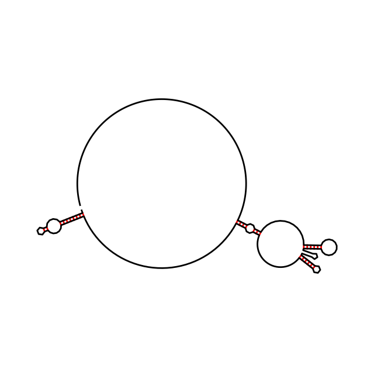
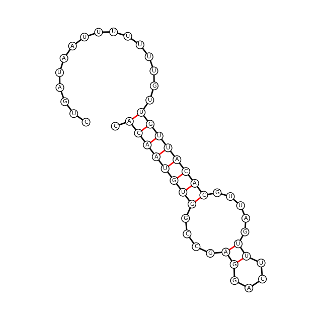
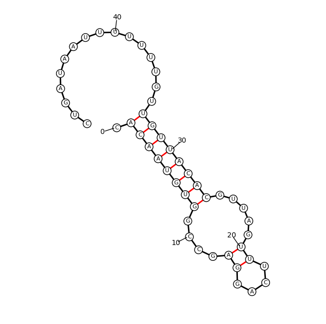
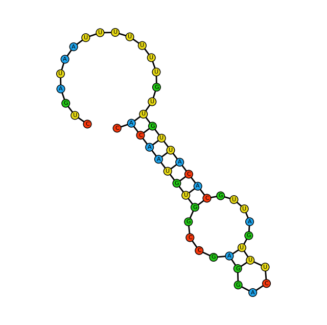
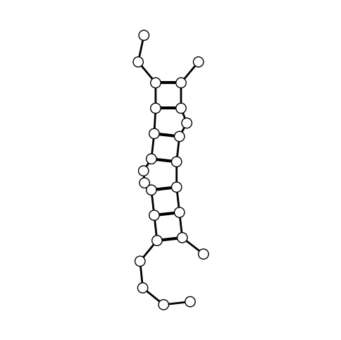

```python
from core import NucDraw
# pip install git+https://github.com/yourusername/nucdraw

```


```python
# Let's generate a simple-to-read graph for a long RNA fold

seq = "CACAAUGUGGCCGAGGACUUUGAUUGCACAUUGUUGUUUUUUUAAUAGUCAUUCCAAAUAUGAGAUGCGUUGUUACAGGAAGUCCCUUGCCAUCCUAAAAGCCACCCCACUUCUCUCUAAGGAGAAUGGCCCAGUCCUCUCCCAAGUCCACACAGGGGAGGUGAUAGCAUUGCUUUCGUGUAAAUUAUGUAAUGCAAAAUUUUUUUAAUCUUCGCCUUAAUACUUUUUUAUUUUGUUUUAUUUUGAAUGAUGAGCCUUCGUGCCCCCCCUUCCCCCUUUUUUGUCCCCCAACUUGAGAUG"
mfe = ".((((((((....((....)).....)))))))).......................................((((..(((............................((((((....))))))...........((((((............))))))............)))..))))......................................................................................................................"

nc = NucDraw(mfe)
nc.generate(degree=90)
nc.plotter(8, bckwargs={'lw':2, 'color':'k'}, bpkwargs={'lw':2, 'c':'red'}, scwargs={'s':10, 'c':'k'})

```


    

    


```python
# Let's focus on one section and increase the details

seq = "CACAAUGUGGCCGAGGACUUUGAUUGCACAUUGUUGUUUUUUUAAUAGUCAUUCCAAAUAUGAGAUGCGUUGUUACAGGAAGUCCCUUGCCAUCCUAAAAGCCACCCCACUUCUCUCUAAGGAGAAUGGCCCAGUCCUCUCCCAAGUCCACACAGGGGAGGUGAUAGCAUUGCUUUCGUGUAAAUUAUGUAAUGCAAAAUUUUUUUAAUCUUCGCCUUAAUACUUUUUUAUUUUGUUUUAUUUUGAAUGAUGAGCCUUCGUGCCCCCCCUUCCCCCUUUUUUGUCCCCCAACUUGAGAUG"
mfe = ".((((((((....((....)).....)))))))).......................................((((..(((............................((((((....))))))...........((((((............))))))............)))..))))......................................................................................................................"

seq = seq[:50]
mfe = mfe[:50]

nc = NucDraw(mfe)
nc.generate(degree=90)
nc.plotter(8, bckwargs={'lw':2, 'color':'k'}, bpkwargs={'lw':2, 'c':'red'}, scwargs={'s':10, 'c':'k'})
nc.plot_circles(circle_size = 4, circle_color='white')
nc.plot_sequence(seq, {'fontsize':8, 'color':'k'})
```


    

    


```python
# Let's focus on one section and increase the details
# Let's color-code the nucleobases

seq = "CACAAUGUGGCCGAGGACUUUGAUUGCACAUUGUUGUUUUUUUAAUAGUCAUUCCAAAUAUGAGAUGCGUUGUUACAGGAAGUCCCUUGCCAUCCUAAAAGCCACCCCACUUCUCUCUAAGGAGAAUGGCCCAGUCCUCUCCCAAGUCCACACAGGGGAGGUGAUAGCAUUGCUUUCGUGUAAAUUAUGUAAUGCAAAAUUUUUUUAAUCUUCGCCUUAAUACUUUUUUAUUUUGUUUUAUUUUGAAUGAUGAGCCUUCGUGCCCCCCCUUCCCCCUUUUUUGUCCCCCAACUUGAGAUG"
mfe = ".((((((((....((....)).....)))))))).......................................((((..(((............................((((((....))))))...........((((((............))))))............)))..))))......................................................................................................................"

seq = seq[:50]
mfe = mfe[:50]

nc = NucDraw(mfe)
nc.generate(degree=90)
nc.plotter(8, bckwargs={'lw':2, 'color':'k'}, bpkwargs={'lw':2, 'c':'k'}, scwargs={'s':10, 'c':'k'})
nc.plot_circles(seq, circle_size = 4)
nc.plot_sequence(seq, {'fontsize':8, 'color':'k'})
```


    

    


```python
# Let's draw a 2-strands complex

seq1 = 'UGACGUAAAACUGAC'
seq2 = 'UGUUACCGUA'
seq = "".join([seq1, seq2])
mfe = '..((((..(((....+.))))).)).'

nc = NucDraw(mfe)
nc.generate()
nc.plotter(6, bckwargs={'lw':2, 'color':'k'}, bpkwargs={'lw':3, 'c':'k'}, scwargs={'s':10, 'c':'k'})
nc.plot_circles(seq, circle_size = 3, circle_color='white')
```


    

    


```python
# Let's draw a 3-strands complex and color the strands differently

seq1 = 'UGACGUAAAACUGAC'
seq2 = 'UGUUACCGUAGUACG'
seq3 = 'ACCGUAC'
seq = "".join([seq1, seq2, seq3])
mfe = '..((((..(((....+.))))).)).(((((+..)))))'

nc = NucDraw(mfe)
nc.generate()
nc.plotter(8, bckwargs={'lw':2, 'color':'k'}, bpkwargs={'lw':3, 'c':'k'}, scwargs={'s':10, 'c':'k'})
nc.plot_circles(seq, circle_size = 2, circle_color='white')
nc.multistrand_coloring(clr=['red', 'blue', 'green'], bckwargs={'lw' : 3})
```


    

    

